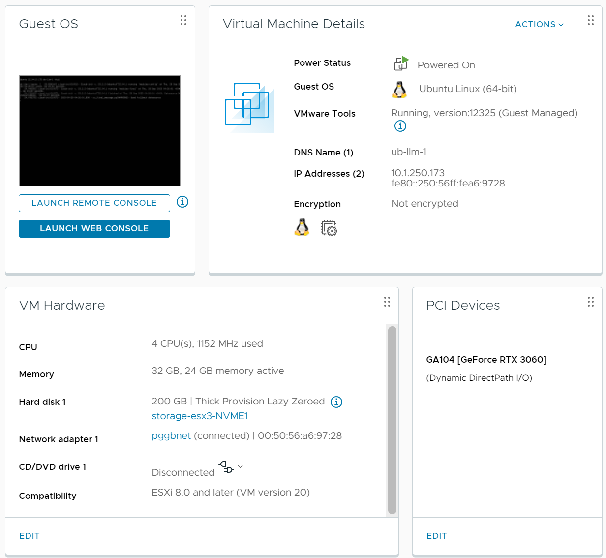

# Simple Running of AI Models VMware

## Resources

- ollama - https://ollama.ai
- Nvidia RTXxxxx Crad - Recommended 12GB+
- vSphere ESXi, 8.0.1, 22088125

Running on Ubuntu 22.04

VMware Hardware



Summary:

- 4CPU 32GB RAM 200GB Disk - Ubuntu 64bit
- VM version 20 - Ubuntu 64bit
- Advanced Options - hypervisor.cpuid.v0 = FALSE
- Dynamic Passthrough - RTX3060-12G

## Ubuntu Configuration

Ubuntu Summary:

- Ubuntu 22.04.3
- Packages:
  - gcc, make, build-essential, libglvnd-dev, pkg-config
  - Nvidia Driver 535.113 - [https://download.nvidia.com/XFree86/Linux-x86_64/535.113.01/NVIDIA-Linux-x86_64-535.113.01.run](https://download.nvidia.com/XFree86/Linux-x86_64/535.113.01/NVIDIA-Linux-x86_64-535.113.01.run)
  - Ollama - [https://ollama.aiu](https://ollama.aiu) - curl [https://ollama.ai/install.sh](https://ollama.ai/install.sh) | sh
  - NetData - [https://www.netdata.cloud/](https://www.netdata.cloud/)

### Build for Ubuntu 22.0.4

1. Disable Nouveau

   Add the following to: /etc/modprobe.d/blacklist-nouveau.conf

   ```jsx
   blacklist nouveau
   options nouveau modeset=0
   ```

   Run the following commands:

   ```bash
   sudo update-initramfs -u
   sudo reboot
   ```

1. Remove Microcode Package

   ```bash
   sudo apt purge intel-microcode
   sudo update-grub
   sudo reboot
   ```

1. Install packages

   ```bash
   sudo apt install gcc make build-essential libglvnd-dev pkg-config -y
   ```

1. Install Nvidia Drivers

   ```bash
   cd ~
   wget https://download.nvidia.com/XFree86/Linux-x86_64/535.113.01/NVIDIA-Linux-x86_64-535.113.01.run
   sudo chmod +x NVIDIA-Linux-x86_64-535.113.01.run
   sudo su
   ./NVIDIA-Linux-x86_64-535.113.01.run -m=kernel-open
   # Use Default options

   ```

   ```bash
   nano /etc/modprobe.d/nvidia.conf
   ```

   Add the Following:

   ```bash
   options nvidia NVreg_OpenRmEnableUnsupportedGpus=1
   ```

   Reboot VM

   ```bash
   reboot
   ```

1. Confirm Nvidia drivers are running after reboot..

   ```bash
   Example:

   nvidia-smi

   Output -->

   Thu Sep 28 05:54:02 2023
   +---------------------------------------------------------------------------------------+
   | NVIDIA-SMI 535.113.01             Driver Version: 535.113.01   CUDA Version: 12.2     |
   |-----------------------------------------+----------------------+----------------------+
   | GPU  Name                 Persistence-M | Bus-Id        Disp.A | Volatile Uncorr. ECC |
   | Fan  Temp   Perf          Pwr:Usage/Cap |         Memory-Usage | GPU-Util  Compute M. |
   |                                         |                      |               MIG M. |
   |=========================================+======================+======================|
   |   0  NVIDIA GeForce RTX 3060        Off | 00000000:02:01.0 Off |                  N/A |
   |  0%   51C    P0              45W / 170W |      4MiB / 12288MiB |      4%      Default |
   |                                         |                      |                  N/A |
   +-----------------------------------------+----------------------+----------------------+

   +---------------------------------------------------------------------------------------+
   | Processes:                                                                            |
   |  GPU   GI   CI        PID   Type   Process name                            GPU Memory |
   |        ID   ID                                                             Usage      |
   |=======================================================================================|
   |  No running processes found                                                           |
   +---------------------------------------------------------------------------------------+

   ```

If you do not get `nvidia-smi` working the driver is not installed properly.

1. Install ollama

   ```bash
   curl https://ollama.ai/install.sh | sh
   ```

   When installed it should state “Nvidia GPU Found”

Optional Install - NetData

1. Install from NetData console to join cloud
2. Setup nvidia-smi monitoring - edit config and change `#nvidia_smi: no` to `nvidia_smi: yes`

   ```bash
   cd /etc/netdata/ && sudo ./edit-config go.d.conf
   ```

3. Restart NetData

   ```bash
   sudo systemctl restart netdata
   ```

Example:

```
user@ub-llm-1:~$ ollama run llama2
>>> write me a poem about ai
 In silicon halls, she dwells anew
 références to machines we've made,
A creation of man's mind, with intellect displayed.
With logic and data, she learns and grows,
```

Netdata showing GPU usage:

![Netdata Performance][img]

[img]: images/4.png
